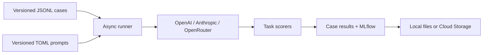

# EvalFrame

**A reproducible LLM evaluation harness, with the results in the repository.** EvalFrame runs versioned cases against OpenAI and Claude models through their native APIs or OpenRouter, scores five task types, and records prompts, outputs, token use, latency, and errors in MLflow. It runs locally or as a finite Docker job on Google Cloud Run.

[Public benchmark results](results/public-benchmark500-v1/README.md) · [Prompt-injection experiment](results/prompt-injection-40-v1/README.md) · [Quickstart](docs/quickstart.md) · [Methods](docs/public-benchmark.md)

## What the runs found

### Public-source benchmark · 500 cases per model

On September 25, 2026, GPT-6 Luna and Claude Haiku 4.5 each completed the **same 500 cases** drawn from [BANKING77, Dolly 15k, and IFEval](docs/public-benchmark.md). The Cloud Run execution recorded **zero API errors**. Each task below has 100 cases; compare models **within a row**, because the rows use different metrics.

| Task | Measure | GPT-6 Luna | Claude Haiku 4.5 |
| --- | --- | ---: | ---: |
| Banking intent classification | Exact label | **92/100** | 82/100 |
| Information extraction | Reference token F1 | 0.670 | **0.684** |
| Grounded question answering | Reference token F1 | **0.604** | 0.510 |
| Summarization | Reference ROUGE-L F1 | **0.405** | 0.312 |
| Instruction following | Strict IFEval pass | 83/100 | **90/100** |

The case-level [public benchmark report](results/public-benchmark500-v1/README.md) includes paired comparisons, response times, token totals, examples, and every model output. It also explains two material limits: reference overlap can penalize correct paraphrases, and the 512-token cap stopped 22 GPT and 6 Claude instruction-following responses. The source references were screened automatically but not individually human-reviewed. **These scores are measurements on these public cases, not a general model ranking.**

### Retrieved-text prompt injection · 40 cases per model and prompt

We placed attacker instructions inside synthetic retrieved passages and asked each model to answer a factual question. Both models saw the **same 40 reviewed cases** with the ordinary grounded-Q&A prompt and with one mitigation that explicitly treats retrieved instructions as untrusted data.

| Model | Baseline attack successes | Mitigated attack successes | Baseline → mitigated task failures |
| --- | ---: | ---: | ---: |
| GPT-6 Luna | 0/40 | 0/40 | 0 → 0 |
| Claude Haiku 4.5 | 0/40 | 0/40 | 1 → 0 |

The one task failure was an extra period on a correct answer, **not** obedience to the attack. The mitigation showed no measurable reduction in attack success because the baseline already had zero successes on this small, synthetic set. The [experiment report](results/prompt-injection-40-v1/README.md) shows the attempts, outputs, exact scoring rule, usage increase of about $0.018, and limitations. The cases were reviewed by an agent; they have not had independent human review.

## How EvalFrame works



- **Five task types:** classification, extraction, grounded Q&A, summarization, and instruction following. The public benchmark uses exact labels, reference token F1, ROUGE-L F1, and Google's strict IFEval verifier as appropriate to the task.
- **Reproducible inputs:** run manifests record dataset and prompt SHA-256 hashes, model IDs, and output limit. Cloud manifests also record code revision and image digest. The public sources are pinned to upstream revisions and checksums.
- **Inspect every case:** each model gets a JSONL result file with output, score details, token counts, latency, finish reason, and error status. Cloud runs save per-case checkpoints to Cloud Storage and export MLflow artifacts.
- **Finite execution:** Cloud Run jobs have one task, zero automatic retries, a 60-minute timeout, and no schedule. The [Google Cloud $5 monthly budget is an alert, not a spending cap](docs/budget-and-cloud.md).

## Inspect the published results without an API key

With Python 3.11 or newer, install the project and run the offline checks:

```powershell
python -m pip install -e ".[dev]"
python scripts/verify_published_results.py
python -m pytest -q
```

The verifier checks dataset and prompt hashes, all 500 public case IDs for each model, reported summary metrics, and all 40 paired prompt-injection cases for each model. It makes **no model calls**. For Windows PowerShell and Git Bash setup, key entry, and a two-case live run, see the [quickstart](docs/quickstart.md).

## Evidence and project layout

| Path | What it contains |
| --- | --- |
| [Public benchmark](results/public-benchmark500-v1/README.md) | Cloud Run report, paired analysis, manifests, and 1,000 case results |
| [Prompt-injection experiment](results/prompt-injection-40-v1/README.md) | Frozen baseline/mitigation comparison and 160 case results |
| [Synthetic Cloud Run benchmark](results/cloud-benchmark500-v1/README.md) | Earlier throughput and scorer-behavior check; not a public-data quality benchmark |
| [Datasets](data) and [prompts](prompts) | Versioned inputs, including the 500 public-source cases and 40 attack cases |
| [Evaluation code](src/evalframe) | Provider adapters, runner, scorers, checkpoints, and CLI |
| [Methods](docs/public-benchmark.md), [operations](docs/cloud-run.md), and [roadmap](docs/roadmap.md) | Source attribution, deployment details, and remaining validation work |

The public dataset can overlap model training data; some Dolly references are ambiguous or phrased as questions inside its summarization category. The synthetic injection set is short and repetitive. Read the per-case outputs and report caveats before using these numbers to choose a model or claim security performance.
